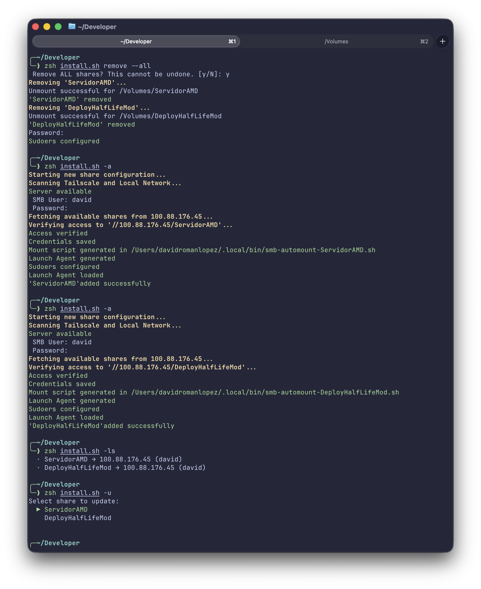

# smb-automount

> Persistent, reliable SMB auto-mounting for macOS.

macOS forgets your mounted network volumes every time your laptop sleeps, wakes, or loses the connection. The usual fix is painful: mount a network share in Finder via **⌘K** (`smb://host/share`), type the server address, enter your username, type your password — and repeat for every share. **smb-automount** solves this permanently by registering your shares as persistent LaunchAgents that reconnect automatically whenever the volume goes missing.

---

## Why this exists

I created this tool based on my own experience having to manually add the user and password for every smb volume in finder with cmd+k every single time y close my Macbook lid.
I thought that should be automatically handled by the OS and decided to do it.

This script automates the entire lifecycle:

- Saves credentials securely in **macOS Keychain** (never stored in plain text)
- Generates a **mount script** per share that retrieves the password from Keychain and mounts the volume
- Handles VPNs & Sleep: Optimized to wait for network availability without hanging Finder.
- Smart Cleanup: Automatically detects and removes "stale" mount points (ghost folders) that often break standard mounting.
- Mutex Concurrency: Uses a "locking" system to prevent network collisions when mounting multiple shares from the same server simultaneously.
- Gives you a simple CLI to **add, update, list, or remove** shares at any time

---

## Requirements

- macOS (tested on macOS Tahoe 26.5)
- Zsh (default shell since macOS Catalina)
- Network access to your SMB server
- (Optional) This tool was made to work with local network and Tailscale, so its recommended to use it.

---

## Installation

> Brew installation (Recommended)

```zsh
brew tap davidrlopez/tap
brew install smb-automount
```

 

> Manual installation

```zsh
git clone https://github.com/davidrlopez/smb-automount.git
cd smb-automount
chmod +x smb-automount
./smb-automount -a
```

During `-a || --add`, the script will ask for:

| Prompt      | Description                                                        |
| ----------- | ------------------------------------------------------------------ |
| SMB User    | Your SMB username                                                  |
| Password    | Stored securely in Keychain — never written to disk                |
| Server IP   | IP address or hostname of your SMB server                          |
| Volume name | The volume name as it appears in `/Volumes/` (e.g. `NAS`, `Media`) |

---

## Usage

```zsh
smb-automount [command]
```

| Command        | Alias | Description                                                |
| -------------- | ----- | ---------------------------------------------------------- |
| `add`          | `-a`  | Add a new SMB share and register it as a LaunchAgent       |
| `remove`       | `-r`  | Remove a share, its agent, and its keychain entry          |
| `remove --all` | ""    | Removes all mounted smb volumes                            |
| `list`         | `-ls` | List all configured shares                                 |
| `update`       | `-u`  | Update credentials or host for an existing share           |
| `uninstall`    | `-un` | Remove everything — agents, scripts, config, sudoers entry |
| `help`         | `-h`  | Show usage                                                 |

## 

## How it works

```
The tool creates a small, efficient "Watchdog" for each share:

Discovery: Scans for local mDNS (.local) and Tailscale (100.x.x.x) hosts.

Security: Stores credentials in macOS Keychain (security add-generic-password).

Logic: Generates a script in ~/.local/bin/ that:

Checks if the volume is already mounted (exact match).

Uses a Mutex Lock (/tmp/smb-automount.lock) to ensure shares mount one by one, preventing server rejection.

Cleans up "Ghost folders" in /Volumes before mounting.

Persistence: Registers a native LaunchAgent that runs every 15 seconds.
```

### File layout

```
~/.config/smb-automount/
└── config                          # Share names, hosts, users (no passwords)

~/.local/bin/
└── smb-automount-<share>.sh        # Mount script per share

~/Library/LaunchAgents/
└── com.davidromanlopez.smb-automount-<share>.plist   # LaunchAgent per share

/etc/sudoers.d/
└── smb-automount                   # Allows passwordless mkdir + chown on /Volumes/
```

---

## Security

- Passwords are stored exclusively in **macOS Keychain** using `security add-generic-password`
- The config file contains only hostnames and usernames — **no passwords**
- The sudoers entry grants passwordless access only to `mkdir` and `chown` on specific `/Volumes/<share>` paths — nothing else
- Keychain entries are cleaned up automatically on `remove` and `uninstall`

---

## Uninstalling

```zsh
smb-automount --uninstall
```

This will:

- Unmount all managed volumes
- Unload and delete all LaunchAgents
- Remove all mount scripts
- Delete the config directory
- Remove the sudoers entry
- Delete all Keychain entries

---

## License

MIT © David Román López
Copyright (c) 2026 David Román López
